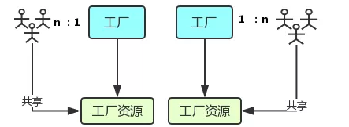
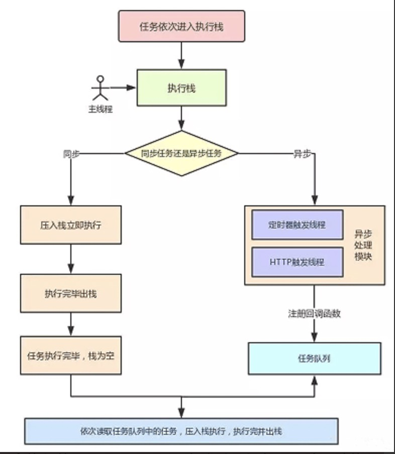

---
tags:
  - Event
  - 宏任务
  - 微任务
  - EventLoop
---

## 一、JavaScript 单线程机制

首先我们都知道，`JavaScript`是一门单线程的语言，所谓单线程指的是在`JavaScript`引擎中负责解释和执行代码的线程只有一个，通常称为主线程。那么为什么`JavaScript`必须是单线程的语言，而不能像他的老大哥`Java`一样，手动开启多个线程呢？

因为这是由于`JavaScript`所运行的浏览器环境决定，他只能是单线程的。试想一下，如果`JavaScript`能开启多个线程，页面上有一个`div`，我们同时在多个线程中来改变这个`div`中的内容，那么最终这个`div`会变成什么样子谁也确定不了，最后只能听天由命，看哪个线程是最后一个运行结束的。

其实`JavaScript`也可以通过`Web Worker`开启多线程是的，但是这个新开线程的功能被限制了，只能做一些消耗`CPU`的逻辑运算等，数据传输也是通过回调的方式来进行，不会阻塞主线程的执行；而且最最重要的是，`Web Worker`不能来操作`dom`，笔者经过尝试发现，在新开的线程中甚至都不能获取到`document`和`window`对象。

## 二、同步任务和异步任务

因为`JavaScript`是单线程运行的，所有的任务只能在主线程上排队执行；但是如果某个任务特别耗时，比如`Ajax`请求一个接口，可能 1s 返回结果，也可能 10s 才返回，有很多的不确定因素（网络延迟等）；如果这些任务也放到主线程中去，那么会阻塞浏览器（用户除了等，不能进行其他操作）。于是，浏览器就把这些任务分派到异步任务队列中去。

## 三、什么是事件循环

事件循环的流程大致如下：

1. 所有任务都在主线程上执行，形成一个执行栈。
2. 主线程发现有异步任务，就在“任务队列”之中加入一个任务事件。
3. 一旦“执行栈”中的所有同步任务执行完毕，系统就会读取“任务队列”（先进先出原则）。那些对应的异步任务，结束等待状态，进入执行栈并开始执行。
4. 主线程不断重复上面的第三步，这样的一个循环称为事件循环。

## 四、宏任务与微任务

如果任务队列中有多个异步任务，那么先执行哪个任务呢？于是在异步任务中，也进行了等级划分，分为宏任务`（macrotask）`和微任务`（microtask）`；不同的 API 注册的任务会依次进入自身对应的队列中，然后等待事件循环将它们依次压入执行栈中执行。

宏任务包括：

- _script(整体代码)_
- setTimeout,
- setInterval,
- setImmediate,
- requestAnimationFrame
- postMessage
- _I/O_
- UI rendering

微任务包括：

- process.nextTick
- Promise
- Object.observe(已废弃)
- MutationObserver(html5 新特性)

我们可以把整体的 JS 代码也看成是一个宏任务，主线程也是从宏任务开始的。我们把上面事件循环的步骤更新一下：


1. 执行一个宏任务
2. 执行过程中如果遇到微任务就加入微任务队列，遇到宏任务就加入宏任务队列
3. 宏任务执行完毕后，检查当前微任务队列，如果有，就依次执行（一轮事件循环结束）
4. 开始下一个宏任务

`process.nextTick` 是一个独立于 `eventLoop` 的任务队列。在每一个 `eventLoop` 阶段完成后会去检查 `nextTick` 队列，如果里面有任务，会让这部分任务优先于微任务执行。是所有异步任务中最快执行的。

## 五、async 与 await

`async` 是异步的意思，`await `则可以理解为 `async wait`。所以可以理解`async`就是用来声明一个异步方法，而 `await `是用来等待异步方法执行

### async

`async`函数返回一个`promise`对象，下面两种方法是等效的

```javascript
function f() {
  return Promise.resolve('TEST');
}

// asyncF is equivalent to f!
async function asyncF() {
  return 'TEST';
}
```

### await

正常情况下，`await`命令后面是一个 `Promise `对象，返回该对象的结果。如果不是 `Promise `对象，就直接返回对应的值

```javascript
async function f() {
  // 等同于
  // return 123
  return await 123;
}
f().then((v) => console.log(v)); // 123
```

不管`await`后面跟着的是什么，`await`都会阻塞后面的代码

```javascript
async function fn1() {
  console.log(1);
  await fn2();
  console.log(2); // 阻塞
}

async function fn2() {
  console.log('fn2');
}

fn1();
console.log(3);
```

上面的例子中，`await` 会阻塞下面的代码（即加入微任务队列），先执行 `async `外面的同步代码，同步代码执行完，再回到 `async` 函数中，再执行之前阻塞的代码

所以上述输出结果为：`1`，`fn2`，`3`，`2`

## 六、Node 和浏览器事件循环机制有何不同

### 1. 线程与进程

> **进程是 CPU 资源分配的最小单位；线程是 CPU 调度的最小单位**



- 进程好比图中的工厂，有单独的专属自己的工厂资源。

- 线程好比图中的工人，多个工人在一个工厂中协作工作，工厂与工人是 1:n 的关系。也就是说**一个进程由一个或多个线程组成，线程是一个进程中代码的不同执行路线**；

- 工厂的空间是工人们共享的，这象征**一个进程的内存空间是共享的，每个线程都可用这些共享内存**。

- 多个工厂之间独立存在。

以 Chrome 浏览器中为例，当你打开一个 Tab 页时，其实就是创建了一个进程，一个进程中可以有多个线程，比如渲染线程、JS 引擎线程、HTTP 请求线程等等。当你发起一个请求时，其实就是创建了一个线程，当请求结束后，该线程可能就会被销毁。

浏览器内核是多线程，在内核控制下各线程相互配合以保持同步，一个浏览器通常由以下常驻线程组成：

- GUI 渲染线程
- JavaScript 引擎线程
- 定时触发器线程
- 事件触发线程
- 异步 http 请求线程

### 2. 浏览器中的 Event Loop



- 一开始执行栈空,我们可以把**执行栈认为是一个存储函数调用的栈结构，遵循先进后出的原则**。micro 队列空，macro 队列里有且只有一个 script 脚本（整体代码）。

- 全局上下文（script 标签）被推入执行栈，同步代码执行。在执行的过程中，会判断是同步任务还是异步任务，通过对一些接口的调用，可以产生新的 macro-task 与 micro-task，它们会分别被推入各自的任务队列里。同步代码执行完了，script 脚本会被移出 macro 队列，这个过程本质上是队列的 macro-task 的执行和出队的过程。

- 上一步我们出队的是一个 macro-task，这一步我们处理的是 micro-task。但需要注意的是：当 macro-task 出队时，任务是**一个一个**执行的；而 micro-task 出队时，任务是**一队一队**执行的。因此，我们处理 micro 队列这一步，会逐个执行队列中的任务并把它出队，直到队列被清空。

- **执行渲染操作，更新界面**

- 检查是否存在 Web worker 任务，如果有，则对其进行处理

- 上述过程循环往复，直到两个队列都清空

### 3. Node 中的 Event Loop

`Node` 中的 `Event Loop` 和浏览器中的是完全不相同的东西。Node.js 采用 V8 作为 js 的解析引擎，而 I/O 处理方面使用了自己设计的`libuv`，`libuv`是一个基于事件驱动的跨平台抽象层，封装了不同操作系统一些底层特性，对外提供统一的 API，事件循环机制也是它里面的实现（下文会详细介绍）

Node.js 的运行机制如下:

- V8 引擎解析`JavaScript`脚本。
- 解析后的代码，调用 Node API。
- `libuv`库负责 Node API 的执行。它将不同的任务分配给不同的线程，形成一个 Event Loop（事件循环），以异步的方式将任务的执行结果返回给 V8 引擎。
- V8 引擎再将结果返回给用户。


从上图中，大致看出 node 中的事件循环的顺序：

**_外部输入数据-->轮询阶段(poll)-->检查阶段(check)-->关闭事件回调阶段(close callback)-->定时器检测阶段(timer)-->I/O 事件回调阶段(I/O callbacks)-->闲置阶段(idle, prepare)-->轮询阶段（按照该顺序反复运行）..._**

- timers 阶段：这个阶段执行 timer（setTimeout、setInterval）的回调
- I/O callbacks 阶段：处理一些上一轮循环中的少数未执行的 I/O 回调
- idle, prepare 阶段：仅 node 内部使用
- poll 阶段：获取新的 I/O 事件, 适当的条件下 node 将阻塞在这里
- check 阶段：执行 setImmediate() 的回调
- close callbacks 阶段：执行 socket 的 close 事件回调

### 4. Node 与浏览器的 Event Loop 差异

浏览器环境下，microtask 的任务队列是每个 macrotask 执行完之后执行。而在 Node.js 中，microtask 会在事件循环的各个阶段之间执行，也就是一个阶段执行完毕，就会去执行 microtask 队列的任务。

## 七、流程分析

通过对上面的了解，我们对`JavaScript`对各种场景的执行顺序有了大致的了解

这里直接上代码：

```javascript
async function async1() {
  console.log('async1 start');
  await async2();
  console.log('async1 end');
}
async function async2() {
  console.log('async2');
}
console.log('script start');
setTimeout(function () {
  console.log('settimeout');
});
async1();
new Promise(function (resolve) {
  console.log('promise1');
  resolve();
}).then(function () {
  console.log('promise2');
});
console.log('script end');
```

分析过程：

1. 执行整段代码，遇到 `console.log('script start')` 直接打印结果，输出 `script start`
2. 遇到定时器了，它是宏任务，先放着不执行
3. 遇到 `async1()`，执行 `async1` 函数，先打印 `async1 start`，下面遇到`await`怎么办？先执行 `async2`，打印 `async2`，然后阻塞下面代码（即加入微任务列表），跳出去执行同步代码
4. 跳到 `new Promise` 这里，直接执行，打印 `promise1`，下面遇到 `.then()`，它是微任务，放到微任务列表等待执行
5. 最后一行直接打印 `script end`，现在同步代码执行完了，开始执行微任务，即 `await `下面的代码，打印 `async1 end`
6. 继续执行下一个微任务，即执行 `then` 的回调，打印 `promise2`
7. 上一个宏任务所有事都做完了，开始下一个宏任务，就是定时器，打印 `settimeout`

所以最后的结果是：`script start`、`async1 start`、`async2`、`promise1`、`script end`、`async1 end`、`promise2`、`settimeout`
