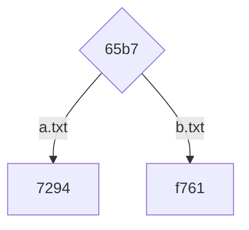
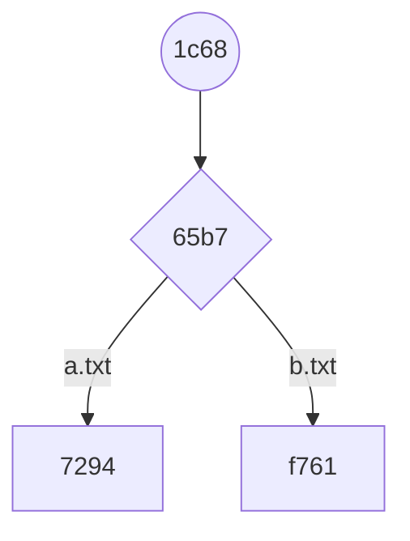
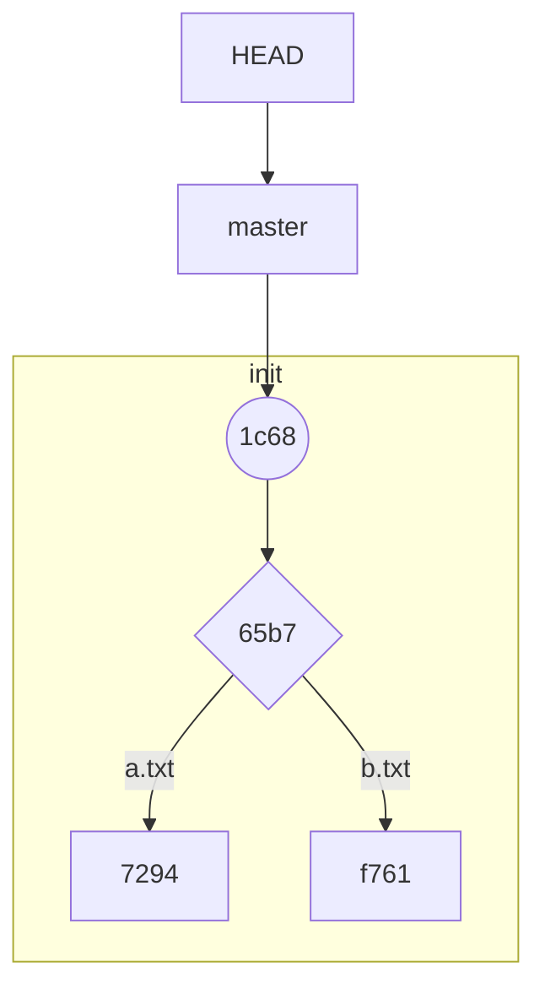
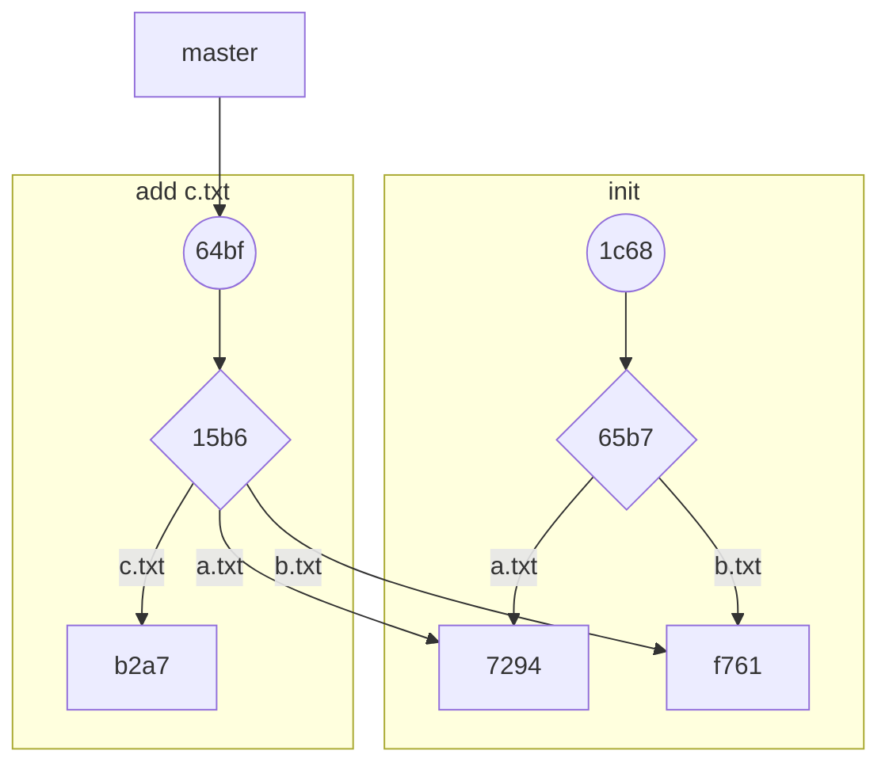
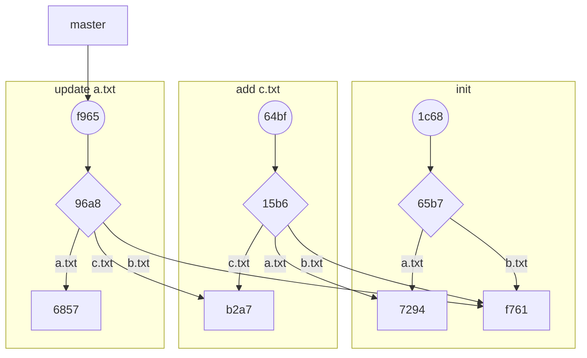

## 1. 初始化`git`仓库

`git init`可以初始化一个本地`git`仓库，执行完命令后在当前目录会存在一个`.git`文件夹，`git`所有的内容、信息都保存在此处，可以用`tree`命令查看`.git`目录下的目录结构：

```bash
~/workspace/github/git-study(master ✗) tree .git
.git
├── HEAD
├── config
├── description
├── hooks
│   ├── applypatch-msg.sample
│   ├── commit-msg.sample
│   ├── fsmonitor-watchman.sample
│   ├── post-update.sample
│   ├── pre-applypatch.sample
│   ├── pre-commit.sample
│   ├── pre-merge-commit.sample
│   ├── pre-push.sample
│   ├── pre-rebase.sample
│   ├── pre-receive.sample
│   ├── prepare-commit-msg.sample
│   └── update.sample
├── info
│   └── exclude
├── objects
│   ├── info
│   └── pack
└── refs
    ├── heads
    └── tags

8 directories, 16 files
```

在这里首先要明确`git`工作的三个目录：

1.  工作区：日常开发用到的工作目录，比如上图的工作区是`git-study`文件夹；
2.  暂存区：一般是`.git`下的`index`文件夹，所以暂存区也叫索引（`index`），在上图中因为项目为空，所以暂时看不到暂存区，当新增了文件并且执行了`git add`命令后，即可看到`.git/index`暂存区；
3.  版本库：工作区下有个`.git`目录，这个不算做工作区里的内容，而是版本库，这里保存了`git`的所有信息（如分支，版本，`commit`信息等等）；

在`.git`文件夹中，`objects`文件夹最为重要，里边保存了项目所有的文件及其改动信息。

## 2. `object`类型

在`git`中存在几种`object`类型。

### 2.1 `blob object`

在工作目录中新增两个文件`a.txt`、`b.txt`，并分别写入内容`aaa`、`bbb`，此时`.git`目录不会有任何变化，因为目前文件只存在工作目录，还未添加到暂存区，此时可以执行`git add .`，再查看`.git`目录：

```shell
~/workspace/github/git-study(master ✗) git add .
~/workspace/github/git-study(master ✗) tree .git
.git
...
├── index
├── objects
│   ├── 72
│   │   └── 943a16fb2c8f38f9dde202b7a70ccc19c52f34
│   ├── f7
│   │   └── 61ec192d9f0dca3329044b96ebdb12839dbff6
...

10 directories, 19 files
```

可以看到在`.git/`下新增了`index`文件，也代表我们将文件添加到了暂存区中。同时在`.git/objects/`下新增了两个`object`，这两个`object`对应新建的两个文件，如果你尝试打开这两个文件，会发现是一串乱码，这是因为`Git`将信息压缩成了二进制文件。

`Git`提供了命令来查看这种类型的文件：

-   `git cat-file -t xxx`：查看`object`的类型；
-   `git cat-file -p xxx`：查看`object`的内容；

在执行以上命令时需要至少传入两个`object`的前四位字符：

```shell
~/workspace/github/git-study(master ✗) git cat-file -t 7294
blob
~/workspace/github/git-study(master ✗) git cat-file -t f761
blob
~/workspace/github/git-study(master ✗) git cat-file -p 7294
aaa
~/workspace/github/git-study(master ✗) git cat-file -p f761
bbb
```

可以看到，这两个`object`都是`blob`类型，且其中保存的内容就是之前我们在文件中输入的`aaa`和`bbb`，至此我们得到了`Git`的第一种`object`：`blob`类型的`object`。它只存储一个文件的内容，不包括文件名等其他信息。然后将这些信息经过`SHA-1`哈希算法得到对应的哈希值：`72943a16fb2c8f38f9dde202b7a70ccc19c52f34`，这个哈希值作为这个`object`在`git`仓库中的唯一身份认证。

此时`.git`仓库是这样的：


### 2.2 `tree object`

使用`git commit`将代码提交到本地仓库：

```shell
~/workspace/github/git-study(master ✗) git commit -m 'init'
[master (root-commit) 1c68353] init
 2 files changed, 2 insertions(+)
 create mode 100644 a.txt
 create mode 100644 b.txt
```

再查看`objects`目录下结构：

```shell
~/workspace/github/git-study(master ✔) tree .git
.git
├── COMMIT_EDITMSG
├── HEAD
├── config
├── description
├── hooks
│   ├── applypatch-msg.sample
│   ├── commit-msg.sample
│   ├── fsmonitor-watchman.sample
│   ├── post-update.sample
│   ├── pre-applypatch.sample
│   ├── pre-commit.sample
│   ├── pre-merge-commit.sample
│   ├── pre-push.sample
│   ├── pre-rebase.sample
│   ├── pre-receive.sample
│   ├── prepare-commit-msg.sample
│   └── update.sample
├── index
├── info
│   └── exclude
├── logs
│   ├── HEAD
│   └── refs
│       └── heads
│           └── master
├── objects
│   ├── 1c
│   │   └── 68353f1c7f17b91032e02f605d3b6e1cdb4f2f
│   ├── 65
│   │   └── b70c81bbedd324eb1d79c90a72ea2bddae82b4
│   ├── 72
│   │   └── 943a16fb2c8f38f9dde202b7a70ccc19c52f34
│   ├── f7
│   │   └── 61ec192d9f0dca3329044b96ebdb12839dbff6
│   ├── info
│   └── pack
└── refs
    ├── heads
    │   └── master
    └── tags

15 directories, 25 files
```

此时发现`.git/objects/`下又多了两个`object`，查看`65b7...`：

```shell
~/workspace/github/git-study(master ✔) git cat-file -t 65b7
tree
~/workspace/github/git-study(master ✔) git cat-file -p 65b7
100644 blob 72943a16fb2c8f38f9dde202b7a70ccc19c52f34	a.txt
100644 blob f761ec192d9f0dca3329044b96ebdb12839dbff6	b.txt
```

至此我们得到了`Git`的第二种`object`：`tree`类型的`object`。它是对当前目录打了一个快照，存储的是一个目录结构以及每一个文件的权限、类型、哈希值以及文件名。

此时的`Git`仓库是这样的：



### 2.3 `commit object`

在[2.2 `tree object`](#2.2 `tree object`)中经过`git commit`操作后，一共新增了两个`object`文件，在此处我们对新增的另一个文件执行`git cat-file`命令：

```shell
~/workspace/github/git-study(master ✔) git cat-file -t 1c68
commit
~/workspace/github/git-study(master ✔) git cat-file -p 1c68
tree 65b70c81bbedd324eb1d79c90a72ea2bddae82b4
author AndyWang <wangyuanwenqi@outlook.com> 1621489526 +0800
committer AndyWang <wangyuanwenqi@outlook.com> 1621489526 +0800

init
```

至此我们得到了第三种类型的`object`：`commit`类型的`object`。它存储的是一个提交信息，包括对应目录结构的快照哈希值，上一个提交的哈希值（这里由于是第一个提交，所以没有父节点）、提交的作者以及提交的时间，最后是该提交的信息。

此时的`Git`仓库是这样的：



### 2.4 `tag object`

当我们对一个`commit`打`tag`的时候，分为两种类型的`tag`：

-   **轻量标签**：产生一个`commit`类型的标签；
-   **附注标签**：产生一个`tag`类型的标签；

#### 2.4.1 轻量标签

```shell
~/workspace/github/git-study(e43d0a6 ✔) git tag v1.0

~/workspace/github/git-study(e43d0a6 ✔) cat .git/refs/tags/v1.0
e43d0a6132a003375449d1d3114f502743df5375

~/workspace/github/git-study(e43d0a6 ✔) git cat-file -t e43d0a6132a003375449d1d3114f502743df5375
commit
```

可以看到，**轻量标签**中保存的是一个`commit-id`，而这个`commit-id`默认就是当前最新的一次`commit`。这个`object`的类型还是一个`commit`。

#### 2.4.2 附注标签

```shell
~/workspace/github/git-study(e43d0a6 ✔) git tag -a v1.1 -m v1.1 description

~/workspace/github/git-study(e43d0a6 ✔) cat .git/refs/tags/v1.1
71830b8b2cc24fa3b079e223d71949c43aec46e5

~/workspace/github/git-study(e43d0a6 ✔) git cat-file -t 71830b8b2cc24fa3b079e223d71949c43aec46e5
tag

~/workspace/github/git-study(e43d0a6 ✔) git cat-file -p 71830b8b2cc24fa3b079e223d71949c43aec46e5
object e43d0a6132a003375449d1d3114f502743df5375
type commit
tag v1.1
tagger AndyWang <wangyuanwenqi@outlook.com> 1622712264 +0800

v1.1 description
```

可以看到，第三个命令得到的结果为一个`tag`，这时我们就得到了`git`中的第四个`object`——`tag`类型，它只存在于打了一个**附注标签**的时候。

### 2.5 `Head` 分支

在`Git`中，`Head`、分支、普通的`tag`都可以简单理解为一个指针，指向对象`commit`的`SHA-1`值：

```shell
~/workspace/github/git-study(master ✔) cat .git/HEAD
ref: refs/heads/master
~/workspace/github/git-study(master ✔) cat .git/refs/heads/master
1c68353f1c7f17b91032e02f605d3b6e1cdb4f2f
```

其结构为：



## 3. `object`产生过程

### 3.1 `git add`过程

在工作目录中新增一个文件`c.txt`，并写入`ccc`。执行`git add`将改动添加到暂存区域：

```shell
~/workspace/github/git-study(master ✗) git add .
~/workspace/github/git-study(master ✗) tree .git
.git
...
├── objects
│   ├── 1c
│   │   └── 68353f1c7f17b91032e02f605d3b6e1cdb4f2f
│   ├── 65
│   │   └── b70c81bbedd324eb1d79c90a72ea2bddae82b4
│   ├── 72
│   │   └── 943a16fb2c8f38f9dde202b7a70ccc19c52f34
│   ├── b2
│   │   └── a7546679fdf79ca0eb7bfbee1e1bb342487380
│   ├── f7
│   │   └── 61ec192d9f0dca3329044b96ebdb12839dbff6
...

16 directories, 26 files
```

可以看到，当执行完`git add .`后，`objects`中新增了`c.txt`对应的`blob object`：`b2a7546679fdf79ca0eb7bfbee1e1bb342487380`

```shell
~/workspace/github/git-study(master ✗) git cat-file -t b2a7
blob
~/workspace/github/git-study(master ✗) git cat-file -p b2a7
ccc
```

### 3.2 `git commit`过程

执行`git commit -m 'add c.txt’`后：

```shell
~/workspace/github/git-study(master ✗) git commit -m 'add c.txt'
[master 64bf692] add c.txt
 1 file changed, 1 insertion(+)
 create mode 100644 c.txt
~/workspace/github/git-study(master ✔) tree .git
.git
...
├── objects
│   ├── 15
│   │   └── b6c2b4cbb04ddb97da706346ed34086664309d
│   ├── 1c
│   │   └── 68353f1c7f17b91032e02f605d3b6e1cdb4f2f
│   ├── 64
│   │   └── bf692c4b951d90a9eaa2f29d9a8776fe9f6d05
│   ├── 65
│   │   └── b70c81bbedd324eb1d79c90a72ea2bddae82b4
│   ├── 72
│   │   └── 943a16fb2c8f38f9dde202b7a70ccc19c52f34
│   ├── b2
│   │   └── a7546679fdf79ca0eb7bfbee1e1bb342487380
│   ├── f7
│   │   └── 61ec192d9f0dca3329044b96ebdb12839dbff6
...

18 directories, 28 files
```

可以看到，执行完`git commit`命令后，`.git/objects/`中新增了`15b6c2b4cbb04ddb97da706346ed34086664309d`、`64bf692c4b951d90a9eaa2f29d9a8776fe9f6d05`两个`object`，对他们分别执行`git cat-file`查看文件：

```shell
~/workspace/github/git-study(master ✔) git cat-file -t 15b6
tree
~/workspace/github/git-study(master ✔) git cat-file -p 15b6
100644 blob 72943a16fb2c8f38f9dde202b7a70ccc19c52f34	a.txt
100644 blob f761ec192d9f0dca3329044b96ebdb12839dbff6	b.txt
100644 blob b2a7546679fdf79ca0eb7bfbee1e1bb342487380	c.txt

~/workspace/github/git-study(master ✔) git cat-file -t 64bf
commit
~/workspace/github/git-study(master ✔) git cat-file -p 64bf
tree 15b6c2b4cbb04ddb97da706346ed34086664309d
parent 1c68353f1c7f17b91032e02f605d3b6e1cdb4f2f
author AndyWang <wangyuanwenqi@outlook.com> 1621494415 +0800
committer AndyWang <wangyuanwenqi@outlook.com> 1621494415 +0800

add c.txt
```

可以看到，新增的两个`object`一个是`tree`类型，保存当前工作目录的文件信息，一个是`commit`类型，保存`git commit`提交的相关信息。

值得一提的是，`commit object`中的`tree`属性指向当前最新的`tree object`，其`parent`指向上一个`commit`的`object`：

```shell
~/workspace/github/git-study(master ✔) git cat-file -p 15b6c2b4cbb04ddb97da706346ed34086664309d
100644 blob 72943a16fb2c8f38f9dde202b7a70ccc19c52f34	a.txt
100644 blob f761ec192d9f0dca3329044b96ebdb12839dbff6	b.txt
100644 blob b2a7546679fdf79ca0eb7bfbee1e1bb342487380	c.txt
~/workspace/github/git-study(master ✔) git cat-file -p 1c68353f1c7f17b91032e02f605d3b6e1cdb4f2f
tree 65b70c81bbedd324eb1d79c90a72ea2bddae82b4
author AndyWang <wangyuanwenqi@outlook.com> 1621489526 +0800
committer AndyWang <wangyuanwenqi@outlook.com> 1621489526 +0800

init
```

此时`.git`仓库结构如下：




## 4. 修改文件

### 4.1 `git add`过程

修改`a.txt`文件为`aaandy`，执行`git add .`命令：

```shell
~/workspace/github/git-study(master ✗) git add .
~/workspace/github/git-study(master ✗) tree .git
.git
...
├── objects
│   ├── 15
│   │   └── b6c2b4cbb04ddb97da706346ed34086664309d
│   ├── 1c
│   │   └── 68353f1c7f17b91032e02f605d3b6e1cdb4f2f
│   ├── 64
│   │   └── bf692c4b951d90a9eaa2f29d9a8776fe9f6d05
│   ├── 65
│   │   └── b70c81bbedd324eb1d79c90a72ea2bddae82b4
│   ├── 68
│   │   └── 57d1446f8b6c55b61954c5930309083fe816fe
│   ├── 72
│   │   └── 943a16fb2c8f38f9dde202b7a70ccc19c52f34
│   ├── b2
│   │   └── a7546679fdf79ca0eb7bfbee1e1bb342487380
│   ├── f7
│   │   └── 61ec192d9f0dca3329044b96ebdb12839dbff6
...

19 directories, 29 files
```

`.git/objects/`下新增了`6857d1446f8b6c55b61954c5930309083fe816fe`文件，查看器内容：

```shell
~/workspace/github/git-study(master ✗) git cat-file -t 6857
blob
~/workspace/github/git-study(master ✗) git cat-file -p 6857
aaandy
```

### 4.2 `git commit`过程

执行`git commit -m 'update a.txt'`：

```shell
~/workspace/github/git-study(master ✗) git commit -m 'update a.txt'
[master f9651a1] update a.txt
 1 file changed, 1 insertion(+), 1 deletion(-)
~/workspace/github/git-study(master ✔) tree .git
.git
...
├── objects
│   ├── 15
│   │   └── b6c2b4cbb04ddb97da706346ed34086664309d
│   ├── 1c
│   │   └── 68353f1c7f17b91032e02f605d3b6e1cdb4f2f
│   ├── 64
│   │   └── bf692c4b951d90a9eaa2f29d9a8776fe9f6d05
│   ├── 65
│   │   └── b70c81bbedd324eb1d79c90a72ea2bddae82b4
│   ├── 68
│   │   └── 57d1446f8b6c55b61954c5930309083fe816fe
│   ├── 72
│   │   └── 943a16fb2c8f38f9dde202b7a70ccc19c52f34
│   ├── 96
│   │   └── a8112ff305a9d8c94985eba8c25bb4c296d43e
│   ├── b2
│   │   └── a7546679fdf79ca0eb7bfbee1e1bb342487380
│   ├── f7
│   │   └── 61ec192d9f0dca3329044b96ebdb12839dbff6
│   ├── f9
│   │   └── 651a1b2b64ea26b960983845a3b7443e81cdcd
...

21 directories, 31 files
```

相对于之前的目录，新增了`96a8112ff305a9d8c94985eba8c25bb4c296d43e`和`f9651a1b2b64ea26b960983845a3b7443e81cdcd`两个文件，对其执行`git cat-file`可以得到：

```shell
~/workspace/github/git-study(master ✔) git cat-file -t f965
commit
~/workspace/github/git-study(master ✔) git cat-file -p f965
tree 96a8112ff305a9d8c94985eba8c25bb4c296d43e
parent 64bf692c4b951d90a9eaa2f29d9a8776fe9f6d05
author AndyWang <wangyuanwenqi@outlook.com> 1621498146 +0800
committer AndyWang <wangyuanwenqi@outlook.com> 1621498146 +0800

update a.txt

~/workspace/github/git-study(master ✔) git cat-file -t 96a8
tree
~/workspace/github/git-study(master ✔) git cat-file -p 96a8
100644 blob 6857d1446f8b6c55b61954c5930309083fe816fe	a.txt
100644 blob f761ec192d9f0dca3329044b96ebdb12839dbff6	b.txt
100644 blob b2a7546679fdf79ca0eb7bfbee1e1bb342487380	c.txt
```

这里同样得到一个`commit`类型的`object`和一个`tree`类型的`object`。此时`Git`库的结构为：



可以看到，如果修改一个文件的话，只会针对新修改的文件生成一个新的快照，未修改的文件还是引用之前的快照。新增文件也是同样的道理。

## 5. `git log`

使用`git log`查看`commit`历史记录：

```shell
~/workspace/github/git-study(master ✔) git log
commit f9651a1b2b64ea26b960983845a3b7443e81cdcd (HEAD -> master)
Author: AndyWang <wangyuanwenqi@outlook.com>
Date:   Thu May 20 16:09:06 2021 +0800

    update a.txt

commit 64bf692c4b951d90a9eaa2f29d9a8776fe9f6d05
Author: AndyWang <wangyuanwenqi@outlook.com>
Date:   Thu May 20 15:06:55 2021 +0800

    add c.txt

commit 1c68353f1c7f17b91032e02f605d3b6e1cdb4f2f
Author: AndyWang <wangyuanwenqi@outlook.com>
Date:   Thu May 20 13:45:26 2021 +0800

    init
```

可以看到使用`git log`查出来的`log`日志，其实就是按顺序展示`commit object`。从`commit object`可以找到对应的`tree object`，从`tree object`又可以找到各个文件对应的`blob object`。

`git log`的运行过程如下：

1.  查找`HEAD`指针对应的分支，本例是`master`
2.  找到`master`指针指向的快照，本例是`f9651a1b2b64ea26b960983845a3b7443e81cdcd`
3.  找到父节点（前一个快照）`64bf692c4b951d90a9eaa2f29d9a8776fe9f6d05`
4.  以此类推，显示当前分支的所有快照。

## 6. `branch`

所谓分支(`branch`)就是指向某个快照的指针，分支名就是指针名。此处可以新建一个·`dev`分支：

```shell
~/workspace/github/git-study(master ✔) git checkout -b dev
Switched to a new branch 'dev'
~/workspace/github/git-study(master ✔) git checkout -b dev
Switched to a new branch 'dev'
~/workspace/github/git-study(dev ✔) tree .git
.git
。。。
└── refs
    ├── heads
    │   ├── dev
    │   └── master
    └── tags

21 directories, 33 files
~/workspace/github/git-study(dev ✔) cat .git/refs/heads/dev
f9651a1b2b64ea26b960983845a3b7443e81cdcd
~/workspace/github/git-study(dev ✔) cat .git/refs/heads/master
f9651a1b2b64ea26b960983845a3b7443e81cdcd
```

可以看到，新建的`dev`分支与`master`的指向是相同的，都是指向最新的`f965`对象。所以`git`新建指针特别容易，成本极低。

Git 有一个特殊指针`HEAD`， 总是指向当前分支的最近一次快照。另外，Git 还提供简写方式，`HEAD^`指向 `HEAD`的前一个快照（父节点），`HEAD~6`则是`HEAD`之前的第6个快照。

每一个分支指针都是一个文本文件，保存在`.git/refs/heads/`目录，该文件的内容就是它所指向的快照的二进制对象名（哈希值）。

<!-- more -->

