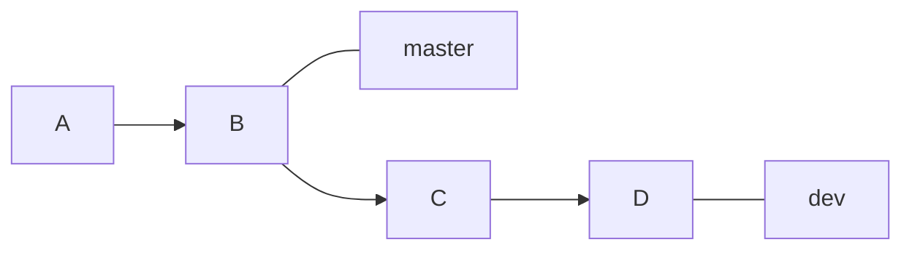
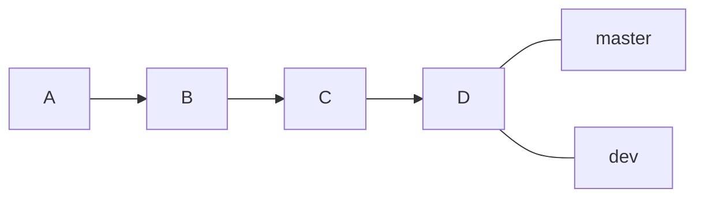

## 1. 文档

基础命令：`git merge`

官方文档地址：[https://git-scm.com/docs/git-merge](https://git-scm.com/docs/git-merge)

功能： 用于将两个或两个以上的开发历史合并到一起。

## 2. 工作模式

`git merge`有三种工作模式：

### 2.1 `Fast forward`

当待合并的两个`branch`最近的`commit`是线性关系时，即当前分支的最新`commit`节点是对方分支的根节点时，此时的合并不会产生合并操作，只是移动指针，也没有对应的`merge commit`信息。

如下图，节点`B`是`dev`对方分支的根节点，且`master`当前分支自`B`节点之后再无新的提交。

当执行`git merge`时，由于他们之间的线性关系，只需要移动`master`的指针即可：

此即为`Fast forward`模式，只需要移动指针，不会产生一个新的`commit`节点。

### 2.2 `Merge made by recursive`

当要合并的两个`branch`的最近`commit`对应的祖先不同时，即两个分支都有各自对应的新`commit`，此时`git`就无法通过移动指针来进行合并，只能以两个`branch`的最新`commit`和他们的共同祖先进行一次`merge`，并对应有一个`merge commit`信息。

### 2.3 `Conflict`

当两个`branch`都修改了同一个文件的同一部分时，这是进行合并操作就会产生冲突，`git`的自动合并就会失败，需要先手工解决冲突，再自行提交。

## 3. 合并策略

>   关于三路合并算法：
>
>   三路合并算法是用于解决冲突的一种方式，当产生冲突时，三路合并算法会获取三个节点：本地冲突的B节点，对方分支的C节点，B、C节点的共同最近祖先节点A。三路合并算法会根据这三个节点进行合并。
>
>   合并过程是：
>
>   1.  B，C节点和A节点进行比较，如果B，C节点的某个文件和A节点中的相同，那么不产生冲突；
>   2.  如果B或C只有一个和A节点相比发生变化，那么该文件将会采用该变化了的版本；
>   3.  如果B和C和A相比都发生了变化，且变化不相同，那么则需要手动去合并;
>   4.  如果B，C都发生了变化，且变化相同，那么并不产生冲突，会自动采用该变化的版本。
>
>   最终合并后会产生D节点，D节点有两个父节点，分为B、C。

`Git`可以通过`-s`参数来指定合并的策略。

### 3.1 `resolve`

仅仅使用三路合并算法合并两个分支的顶部节点（例如当前分支和你拉取下来的另一个分支）。这种合并策略遵循三路合并算法，由两个分支的HEAD节点以及共同子节点进行三路合并。

真正会困扰我们的其实是交叉合并`（criss-cross merge）`这种情况。所谓的交叉合并，是指共同祖先节点有多个的情况，例如在两个分支合并时，很有可能出现共同祖先节点有两个的情况发生，这时候无法按照三路合并算法进行合并（因为共同祖先节点不唯一）。

此时就需要`resolve`策略了：在交叉合并的情况时有一个以上的合并基准点（共同祖先节点），`resolve`策略是这样工作的：选择其中一个可能的合并基准点并期望这是合并最好的结果。实际上这并没有听起来的那么糟糕。通常情况下用户修改不同部分的代码，在这种情况下，很多的合并冲突其实是多余和重复的。而使用`resolve`进行合并时，产生的冲突也较易于处理，真正会遗失代码的情况很少。

### 3.2 `recursive`

仅仅使用三路合并算法合并两个分支。和`resolve`不同的是，在交叉合并的情况时，这种合并方式是递归调用的，从共同祖先节点之后两个分支的不同节点开始递归调用三路合并算法进行合并，如果产生冲突，那么该文件不再继续合并，直接抛出冲突；其他未产生冲突的文件将一直执行到顶部节点。额外地，这种方式也能够检测并处理涉及修改文件名的操作。这是`git`合并和拉取代码的默认合并操作。

`recursive`合并策略有以下参数：

#### 3.2.1 `ours`

该参数将强迫冲突发生时，自动使用当前分支的版本。这种合并方式不会产生任何困扰情况，甚至git都不会去检查其他分支版本所包含的冲突内容这种方式会抛弃对方分支任何冲突内容。

#### 3.2.2 `theirs`

正好和ours相反。
theirs和ours参数都适用于合并二进制文件冲突的情况。

#### 3.2.3 `patience`

在这种参数下，`git merge-recursive`花费一些额外的时间来避免错过合并一些不重要的行（如函数的括号）。如果当前分支和对方分支的版本分支分离非常大时，建议采用这种合并方式。

### 3.3 `octopus`

这种合并方式用于两个以上的分支，但是在遇到冲突需要手动合并时会拒绝合并。这种合并方式更适合于将多个分支捆绑在一起的情况，也是多分支合并的默认合并策略。

### 3.4 `ours`

这种方式可以合并任意数量的分支，但是节点树的合并结果总是当前分支所冲突的部分。这种方式能够在替代旧版本时具有很高的效率。请注意，这种方式和recursive策略下的ours参数是不同的。

### 3.5 `subtree`

subtree是修改版的recursive策略。当合并树A和树B时，如果B是A的子树，B首先调整至匹配A的树结构，而不是读取相同的节点。

## 4. 基础命令

### 4.1 `git merge <branch_name>`

将一个分支合并到当前分支，并自动进行新的提交。

### 4.2 `git merge <branch_1> <branch_2>`

同时合并两个或多个分支到当前分支的顶部，使它们合并。

### 4.3 `-m <msg>`

命令：`git merge <branch_name> -m <msg>`

设置用于创建合并节点时的提交信息，需要注意，当以`Fast-forward`模式提交时，不产生新的`commit`，此命令也就无效。

### 4.4 `--abort`

命令：`git merge <branch_name> --abort`

当合并遇到冲突时会尝试恢复到你运行合并之前的状态。但当运行命令前，在工作目录中有未储藏、未提交的修改时它不能完美处理，除此之外它都工作地很好。

如果处于某些原因你想要再重来一次，也可以运行`git reset --hard HEAD`回到上一次提交的状态，请注意此时任何未提交的工作都会丢失，所以请慎用。

### 4.5 `--commit && --no-commit`

-   `git merge <branch_name> --commit`：合并后产生一个合并结果的`commit`节点，即使它们可以走`Fast forward`模式时，也会在合并时产生一个新的`commit`；
-   `git merge <branch_name> --no-commit`：合并后，为了防止合并失败并不自动提交，能够给使用者一个机会再提交前重新审视、修改合并结果。

### 4.6 `--edit && -e && --no-edit`

-   `git merge <branch_name> --edit`和`git merge <branch_name> -e`：用于在成功合并、提交前调用编辑器来进一步编辑自动生成的合并信息，因此使用者能够进一步解释和判断合并的结果；
-   `git merge <branch_name> --no-edit`：能够用于接收自动合并的信息，通常情况下不鼓励这样做。

需要注意，当以`Fast-forward`模式提交时，不产生新的`commit`，此命令也就无效。

### 4.7 `--ff && --no-ff && --ff-only`

-   `git merge <branch_name> --ff`：使用`Fast-forward`模式进行合并，即只移动指针，不创建一个新的`commit`，这种模式适用于当前节点的最新`commit`是待合并分支的根节点的情况，即两者是线性关系，默认情况下，`git merge`采用`Fast-forward`模式；
-   `git merge <branch_name> --no-ff`：即使是使用`Fast-forward`模式，也要创建一个新的合并节点，这是当`git merge`在合并一个`tag`时的默认行为；
-   `git merge <branch_name> --ff-only`：除非当前节点能够使用`Fast-forward`模式进行合并，否则的话将拒绝合并，并返回一个失败的状态。

### 4.8 `--log[=<n>] && --no-log`

-   `git merge <branch_name> --log[=3]`：将在合并提交时，提交除了还有分支名外，还包含最多3个被合并`commit`节点的日志信息；
-   `git merge <branch_name> --no-log`：并不会列出日志信息。

### 4.9 `--stat && -n && --no-stat`

-   `git merge <branch_name> --stat`：将会在合并结果的末端显示文件差异的状态；
-   `git merge <branch_name> -n`或`git merge <branch_name> --no-stat`：不会显示文件差异的状态。

### 4.10 `--squash && --no-squash`

-   `git merge <branch_name> —squash`：当一个合并发生时，从当前分支和对方分支的共同祖先节点的对方分支节点，一直到对方分支的定点节点将会压缩在一起，使用者可以经过审视后进行提交，只产生一个新的节点。这种方式适用于开发者在新分支提交了大量无意义的节点，当进行合并时，适合将大量提交节点合并成一个节点；
-   `git merge <branch_name> --no-squash`：不进行压缩，默认行为。

### 4.11 `--quiet && -q`

`git merge <branch_name> --quiet`和`git merge <branch_name> -a`:静默操作，不显示合并进度信息。

### 4.12 `--verbose && -v`

`git merge <branch_name> --verbose`和`git merge <branch_name> -v`：显示详细的合并结果信息。

### 4.13 `--progress && --no-progress`

-   `git merge <branch_name> --progress`：显示合并的进度信息；
-   `git merge <branch_name> --no-progress`：不显示合并的进度信息。

如果两者都没有指定，那么在标准错误发生时，将在连接的终端显示信息。
