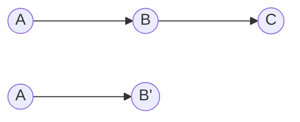
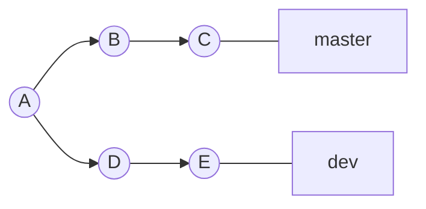
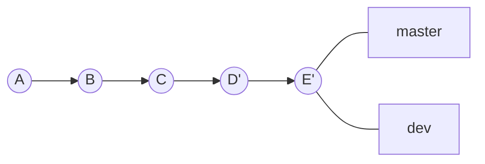

## 1. 文档

基础命令：`git rebase`

官方文档地址：[https://git-scm.com/docs/git-rebase](https://git-scm.com/docs/git-rebase)

功能：变基，可以对某一段线性提交历史进行编辑、删除、复制、粘贴；合理使用`rebase`可以使我们的提交历史干净、简洁。

提示：不要通过`rebase`对任何已经提交到公共仓库中的`commit`进行修改。

## 2. 基础命令

### 2.1 多个`commit`合并为一个完整的`commit`

命令模式：

-   `git rebase -i [startcommit] [endcommit]`：其中`-i`为打开交互面，`[startcommit]`、`[endcommit]`为区间选择，其中`[endcommit]`可以省略；
-   `git rebase -i HEAD~2`：合并最近两个`commit`。


日常开发中，会存在多次`commit`的情况，但并不是每个`commit`都是需要推送到远程主机中的，`git rebase`命令提供了一种方式，可以将本地的多个`commit`合并为一个完整的`commit`，简化我们的提交记录。



如上图所示，当前仓库中存在`commit`记录`A、B、C`，经过`git rebase`需要将`B、C`合并为`B'`。


以下面为例：

我们将最新两个`commit`合并为一个。

```shell
~/workspace/github/git-study(master ✔) git log --graph
* commit f6744cf023142db918ebbf3c30ced50bf659a35a (HEAD -> master)
| Author: AndyWang <wangyuanwenqi@outlook.com>
| Date:   Tue Jun 8 10:33:41 2021 +0800
|
|     add aa to a.txt
|
* commit 442d8f838b9681fec3849c40f4a68d77011ba390
| Author: AndyWang <wangyuanwenqi@outlook.com>
| Date:   Tue Jun 8 10:33:25 2021 +0800
|
|     add a to a.txt
|
* commit d54458266ca9cc99b1f020122ade3486c6e158ab
  Author: AndyWang <wangyuanwenqi@outlook.com>
  Date:   Tue Jun 8 10:33:00 2021 +0800

      init a
```

对当前分支执行`git rebase`命令将多个`commit`合并为一个：

```shell
~/workspace/github/git-study(master ✔) git rebase -i HEAD~2
.git
  1 pick 442d8f8 add a to a.txt
  2 pick f6744cf add aa to a.txt
  3
  4 # Rebase d544582..f6744cf onto d544582 (2 commands)
  5 #
  6 # Commands:
  7 # p, pick <commit> = use commit
  8 # r, reword <commit> = use commit, but edit the commit message
  9 # e, edit <commit> = use commit, but stop for amending
 10 # s, squash <commit> = use commit, but meld into previous commit
 11 # f, fixup <commit> = like "squash", but discard this commit's log message
 12 # x, exec <command> = run command (the rest of the line) using shell
 13 # b, break = stop here (continue rebase later with 'git rebase --continue')
 14 # d, drop <commit> = remove commit
 15 # l, label <label> = label current HEAD with a name
 16 # t, reset <label> = reset HEAD to a label
 17 # m, merge [-C <commit> | -c <commit>] <label> [# <oneline>]
 18 # .       create a merge commit using the original merge commit's
 19 # .       message (or the oneline, if no original merge commit was
 20 # .       specified). Use -c <commit> to reword the commit message.
 21 #
 22 # These lines can be re-ordered; they are executed from top to bottom.
 23 #
 24 # If you remove a line here THAT COMMIT WILL BE LOST.
 25 #
 26 # However, if you remove everything, the rebase will be aborted.
 27 #
 28 # Note that empty commits are commented out
```

修改第二个`pick`命令为`squash`命令：

```shell
.git
  1 pick 442d8f8 add a to a.txt
  2 squash f6744cf add aa to a.txt
  3
  4 # Rebase d544582..f6744cf onto d544582 (2 commands)
  5 #
  6 # Commands:
  7 # p, pick <commit> = use commit
  8 # r, reword <commit> = use commit, but edit the commit message
  9 # e, edit <commit> = use commit, but stop for amending
 10 # s, squash <commit> = use commit, but meld into previous commit
 11 # f, fixup <commit> = like "squash", but discard this commit's log message
 12 # x, exec <command> = run command (the rest of the line) using shell
 13 # b, break = stop here (continue rebase later with 'git rebase --continue')
 14 # d, drop <commit> = remove commit
 15 # l, label <label> = label current HEAD with a name
 16 # t, reset <label> = reset HEAD to a label
 17 # m, merge [-C <commit> | -c <commit>] <label> [# <oneline>]
 18 # .       create a merge commit using the original merge commit's
 19 # .       message (or the oneline, if no original merge commit was
 20 # .       specified). Use -c <commit> to reword the commit message.
 21 #
 22 # These lines can be re-ordered; they are executed from top to bottom.
 23 #
 24 # If you remove a line here THAT COMMIT WILL BE LOST.
 25 #
 26 # However, if you remove everything, the rebase will be aborted.
 27 #
 28 # Note that empty commits are commented out
```

此时保存退出会重新打开一个`vim`编辑器，用来编辑新`commit`的`message`：

```shell
 1 # This is a combination of 2 commits.
  2 # This is the 1st commit message:
  3
  4 add a to a.txt
  5
  6 # This is the commit message #2:
  7
  8 add aa to a.txt
  9
 10 # Please enter the commit message for your changes. Lines starting
 11 # with '#' will be ignored, and an empty message aborts the commit.
 12 #
 13 # Date:      Tue Jun 8 10:33:25 2021 +0800
 14 #
 15 # interactive rebase in progress; onto d544582
 16 # Last commands done (2 commands done):
 17 #    pick 442d8f8 add a to a.txt
 18 #    squash f6744cf add aa to a.txt
 19 # No commands remaining.
 20 # You are currently rebasing branch 'master' on 'd544582'.
 21 #
 22 # Changes to be committed:
 23 #       modified:   a.txt
 24 #
```

此处可以编辑信息，也可以直接保存退出，查看当前历史记录，发现，三个记录已经变成了两个：

```shell
~/workspace/github/git-study(master ✔) git log --graph
* commit 59198b5170b043ac8fe9d64731ed59bf7628f26f (HEAD -> master)
| Author: AndyWang <wangyuanwenqi@outlook.com>
| Date:   Tue Jun 8 10:33:25 2021 +0800
|
|     add a to a.txt
|
|     add aa to a.txt
|
* commit d54458266ca9cc99b1f020122ade3486c6e158ab
  Author: AndyWang <wangyuanwenqi@outlook.com>
  Date:   Tue Jun 8 10:33:00 2021 +0800

      init a
```

### 2.2 合并分支（变基）

整体思想为：

1.  切换到对方分支：
2.  执行`git rebase master`;
3.  切换回`master`，在合并对方分支。

当项目中存在多个分支，有时候我们需要进行合并又想保证`git`记录简约明了时可以采用这种方案：



当进行`rebase`合并后：




以下面为例，存在两个分支，他们各自都有自己的提交：

```shell
~/workspace/github/git-study(master ✔) git log master dev --graph
* commit 4914c5a1eca77f6fe3797f3f65c22e98a574f864 (HEAD -> master)
| Author: AndyWang <wangyuanwenqi@outlook.com>
| Date:   Tue Jun 8 13:23:53 2021 +0800
|
|     master add aa to a.txt
|
* commit 2969ea47fda0ca376df1b1e6e9238ad797a6ce1a
| Author: AndyWang <wangyuanwenqi@outlook.com>
| Date:   Tue Jun 8 11:29:59 2021 +0800
|
|     master add a to a.txt
|
| * commit 86322b31793c24cfb021857f8116c4fc80193e11 (dev)
| | Author: AndyWang <wangyuanwenqi@outlook.com>
| | Date:   Tue Jun 8 13:24:32 2021 +0800
| |
| |     dev add b to b.txt
| |
| * commit 1a31e22b6203957d91d3db0eb0181ab2215d8ff0
|/  Author: AndyWang <wangyuanwenqi@outlook.com>
|   Date:   Tue Jun 8 11:30:21 2021 +0800
|
|       dev add b.txt
|
* commit d54458266ca9cc99b1f020122ade3486c6e158ab
  Author: AndyWang <wangyuanwenqi@outlook.com>
  Date:   Tue Jun 8 10:33:00 2021 +0800

      init a
```

切换到`dev`分支，执行`git rebase`操作。这里要切换到`dev`分支也会是因为`rebase`命令的特性，`rebase`的含义是以谁作为基础进行变基，当然我们要以`master`为基础，所以要先切到`dev’`分支再执行`rebase`。

```shell
~/workspace/github/git-study(dev ✔) git rebase master
First, rewinding head to replay your work on top of it...
Applying: dev add b.txt
Applying: dev add b to b.txt
```

切换回`master`分支，执行`git merge`操作。这里需要再执行一次`merge`是因为刚才的变基只存在于`dev`分支上，`master`上的`commit`还没有变化，需要将刚才的变基结果合并过来。

```shell
~/workspace/github/git-study(master ✔) git merge dev
Updating 4914c5a..5f757aa
Fast-forward
 b.txt | 1 +
 1 file changed, 1 insertion(+)
 create mode 100644 b.txt
```

查看`git log`记录：

```shell
~/workspace/github/git-study(master ✔) git log master dev --graph
* commit 5f757aa912b1d4df71ac79bed1bbebea063f1524 (HEAD -> master, dev)
| Author: AndyWang <wangyuanwenqi@outlook.com>
| Date:   Tue Jun 8 13:24:32 2021 +0800
|
|     dev add b to b.txt
|
* commit a57762f4b6dc96ccc8e0223f1e66696e6acd0784
| Author: AndyWang <wangyuanwenqi@outlook.com>
| Date:   Tue Jun 8 11:30:21 2021 +0800
|
|     dev add b.txt
|
* commit 4914c5a1eca77f6fe3797f3f65c22e98a574f864
| Author: AndyWang <wangyuanwenqi@outlook.com>
| Date:   Tue Jun 8 13:23:53 2021 +0800
|
|     master add aa to a.txt
|
* commit 2969ea47fda0ca376df1b1e6e9238ad797a6ce1a
| Author: AndyWang <wangyuanwenqi@outlook.com>
| Date:   Tue Jun 8 11:29:59 2021 +0800
|
|     master add a to a.txt
|
* commit d54458266ca9cc99b1f020122ade3486c6e158ab
  Author: AndyWang <wangyuanwenqi@outlook.com>
  Date:   Tue Jun 8 10:33:00 2021 +0800

      init a
```

可以看到，`dev`分支上的`commit`都已经衍合到`master`分支上了，且他们的`git`记录是一条线，而不是`merge`之后的两条。

### 2.3 删除指定`commit`

当要删除某个分支中间的`commit`时，可以使用`rebase`命令。

命令模式：

-   `git rebase -i [startcommit] [endcommit]`：其中`-i`为打开交互面，`[startcommit]`、`[endcommit]`为区间选择，其中`[endcommit]`可以省略；
-   `git rebase -i HEAD~4`：处理最近两个`commit`。

整体思想是：

1.  调用`git rebase`命令处理最近的`N`条`commit`；
2.  进入`vim`编辑器后针对需要删除的`commit`，使用`drop`命令将其删除；
3.  保存退出执行即可

例如：

以下面`git`提交记录为例，删除中间的两个`master`字样的`commit`：

```shell
~/workspace/github/git-study(master ✔) git log
commit 5f757aa912b1d4df71ac79bed1bbebea063f1524 (HEAD -> master, dev)
Author: AndyWang <wangyuanwenqi@outlook.com>
Date:   Tue Jun 8 13:24:32 2021 +0800

    dev add b to b.txt

commit a57762f4b6dc96ccc8e0223f1e66696e6acd0784
Author: AndyWang <wangyuanwenqi@outlook.com>
Date:   Tue Jun 8 11:30:21 2021 +0800

    dev add b.txt

commit 4914c5a1eca77f6fe3797f3f65c22e98a574f864
Author: AndyWang <wangyuanwenqi@outlook.com>
Date:   Tue Jun 8 13:23:53 2021 +0800

    master add aa to a.txt

commit 2969ea47fda0ca376df1b1e6e9238ad797a6ce1a
Author: AndyWang <wangyuanwenqi@outlook.com>
Date:   Tue Jun 8 11:29:59 2021 +0800

    master add a to a.txt

commit d54458266ca9cc99b1f020122ade3486c6e158ab
Author: AndyWang <wangyuanwenqi@outlook.com>
Date:   Tue Jun 8 10:33:00 2021 +0800

    init a
```

执行`git rebase`命令，调起`vim`编辑框：

```shell
~/workspace/github/git-study(master ✔) git rebase -i HEAD~4
 	1 drop 2969ea4 master add a to a.txt
  2 drop 4914c5a master add aa to a.txt
  3 pick a57762f dev add b.txt
  4 pick 5f757aa dev add b to b.txt
  5
  6 # Rebase d544582..5f757aa onto 5f757aa (4 commands)
  7 #
  8 # Commands:
  9 # p, pick <commit> = use commit
 10 # r, reword <commit> = use commit, but edit the commit message
 11 # e, edit <commit> = use commit, but stop for amending
 12 # s, squash <commit> = use commit, but meld into previous commit
 13 # f, fixup <commit> = like "squash", but discard this commit's log message
 14 # x, exec <command> = run command (the rest of the line) using shell
 15 # b, break = stop here (continue rebase later with 'git rebase --continue')
 16 # d, drop <commit> = remove commit
 17 # l, label <label> = label current HEAD with a name
 18 # t, reset <label> = reset HEAD to a label
 19 # m, merge [-C <commit> | -c <commit>] <label> [# <oneline>]
 20 # .       create a merge commit using the original merge commit's
 21 # .       message (or the oneline, if no original merge commit was
 22 # .       specified). Use -c <commit> to reword the commit message.
 23 #
 24 # These lines can be re-ordered; they are executed from top to bottom.
 25 #
 26 # If you remove a line here THAT COMMIT WILL BE LOST.
 27 #
 28 # However, if you remove everything, the rebase will be aborted.
 29 #
 30 # Note that empty commits are commented out
```

将两个有`master`字样的提交记录标记为命令`drop`，保存退出执行，查看删除之后的记录：

```shell
~/workspace/github/git-study(master ✔) git log
commit 74fdbf785410310f220f6c2f34afaef6a30e1387 (HEAD -> master)
Author: AndyWang <wangyuanwenqi@outlook.com>
Date:   Tue Jun 8 13:24:32 2021 +0800

    dev add b to b.txt

commit 0ff05c564ef803361804b6d3655328665c062aec
Author: AndyWang <wangyuanwenqi@outlook.com>
Date:   Tue Jun 8 11:30:21 2021 +0800

    dev add b.txt

commit d54458266ca9cc99b1f020122ade3486c6e158ab
Author: AndyWang <wangyuanwenqi@outlook.com>
Date:   Tue Jun 8 10:33:00 2021 +0800

    init a
```

可以看完，已经完美删了了中间的两条历史记录。

### 2.4 `--interactive && -i`

以交互方式进行`rebase`

