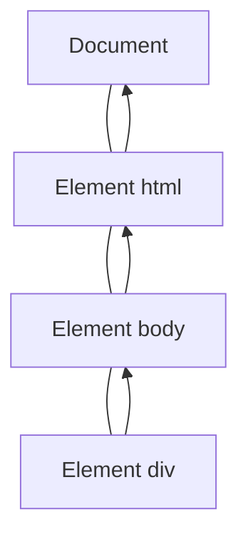
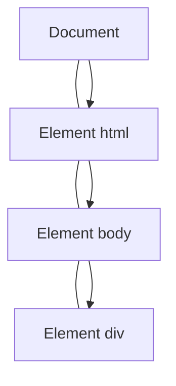

JavaScript与HTML之间的交互是通过事件实现的。事件最早是在 IE3 和 Netscape Navigator 2 中出现的，当时是作为分担服务器运算负载的一种手段，在 IE4 和 Navigator 4 发布时，这两种浏览器都提供了相似但不相同的API，这些API并存经过了好几个主要版本。

DOM2 级规范开始尝试一种符合逻辑的方式来标准化 DOM 事件。目前 IE9， Firefox， Opera， Safari， Chrome 全都已经实现了 DOM2 级事件模块的核心部分。

# 1. 事件流

试想，在页面上点击一个元素，那么不能简单的认为，仅仅点击了这个元素。在点击这个元素的同时，也点击了这个元素的容器，甚至也点击了整个页面。由此，我们产生了事件流的概念。

事件流描述的是从页面中接收事件的顺序。有意思的是，IE 和 Netscape 开发团队提出了差不多是完全相反的事件流的高年。IE 的事件流是事件冒泡，而 Netscape 的事件流是事件捕获。

## 1. 事件冒泡

IE 的事件流叫做***事件冒泡***，即事件开始时由最具体的元素接收，然后逐级向上传播到较为不具体的节点。



click 事件首先在div元素上发生，而这个元素就是我们单击的元素。然后 click 事件沿 DOM 树向上传播，在每一级节点都会发生，直至传播到 document 对象。

所有现代浏览器都支持事件冒泡，但是在具体实现上还有一些差别。IE9，Firefox，Chrome 和 Safari 则将事件一直冒泡到 window 对象。

## 2. 事件捕获

Netscape Communicator 团队提出的另一种事件流叫做***事件捕获***。事件捕获的思想是不太具体的节点应该更早接收事件，而最具体的节点应该最后接收到事件。事件捕获的用意在于在时间到达目标之前捕获它。



事件捕获过程中，document 对象首先接收到 click 事件，然后事件沿 DOM 树依次向下，一直传播到事件的实际目标。

IE9，Safari，Chrome，Opera 和 Firefox 目前都支持这种事件流模型。尽管 "DOM2级事件" 规范要求事件应该从 document 对象开始传播，但这些浏览器都是从 window 对象开始捕获事件的。

由于老版本的浏览器不支持，因此很少有人使用事件捕获，所以这里建议尽量使用事件冒泡。

## 3. DOM事件流

"DOM2级事件" 规定的事情包括三个阶段：事件捕获阶段，处于目标阶段和事件冒泡阶段。首先发生的是事件捕获，为截获事件提供了机会，然后是实际的目标接收到事件，最后一个阶段是冒泡阶段。

多数支持 DOM 事件流的浏览器都实现了一种特定的行为：即使 "DOM2级事件" 规范明确要求捕获阶段不会涉及事件目标，但 IE9，Safari，Chrome，Firefox 和 Opera9.5 及更高版本都会在捕获阶段出发事件对象上的事件。结果，就是有两个机会在目标对象上面操作事件。

IE8 及更早的版本不支持 DOM 事件流。

# 2. 事件处理程序

事件就是用户或浏览器自身执行的某种操作，而相应某个事件的函数就叫做***事件处理程序***（或事件侦听器）。

## 1. HTML事件处理程序

某个元素支持的某种事件，都可以使用一个与相应事件处理程序同名的 HTML 特性来指定。这个特性的值应该是能够执行的 JavaScript 代码：

```html
<input type="button" id="myBtn" onclick="alert('CLicked')">
```

## 2. DOM0级事件处理程序

通过 JavaScript 指定事件处理程序的传统方式，就是将一个函数赋值给一个事件处理程序属性。

```javascript
var btn = document.getElementById('myBtn');
btn.onclick = function() {
  console.log('Clicked', this);
}
```

DOM0 级对每个事件只支持一个事件处理程序。

使用 DOM0 级方法指定的事件处理程序被认为是元素的方法。因此，这时候的事件处理程序是在元素的作用域中运行。换句话说，程序中的 this 引用当前元素。

```javascript
btn.onclick = null;     // 删除事件处理程序
```

## 3. DOM2级事件处理程序

"DOM2级事件" 定义了两个方法，用于处理指定和删除事件处理程序的操作：addEventListener() 和 removeEventListener()。所有 DOM 节点都包含这两个方法，并且它们都接受3个参数：要处理的事件名，作为事件处理程序的函数和一个布尔值。最后这个布尔值如果是 true ，表示在捕获阶段调用事件处理程序；如果是 false ，表示在冒泡阶段调用事件处理程序。

```javascript
btn.addEventListener('click', function() {
  console.log('Clicked');
}, false);
```

使用 DOM2 级方法添加事件处理程序的主要好处是可以添加多个事件处理程序。比如可以添加多个 click 事件，而且这些 click 事件按照添加的顺序依次执行。

通过 addEventListener() 方法添加的事件处理程序只能通过 removeEventListener() 来移除，但是通过匿名函数添加的事件无法移除，若想正确移除，需要以下方式添加

```javascript
var handle = function () {
    console.log('Clicked');
}

btn.addEventListener('click', handle, false);

btn.removeEventListener('click', handle, false);    // 可以正确移除

```

## 4. IE事件处理程序

IE 实现了与 DOM 中类似的两个方法：attachEvent() 和 detackEvent() 。这两个方法接收相同的两个参数：事件处理程序名称和事件处理程序函数，由于 IE8 及更早期的版本只支持事件冒泡，所以通过 attachEvent() 添加的事件处理程序会被添加到冒泡阶段。

```javascript
btn.attachEvent('click', function() {
  console.log('Clicked');
})
```

使用 attackEvent() 也可以为同一个元素添加多个不同的事件处理程序，但是他们的执行顺序是以堆栈的顺序，后进先执行，与 addEventListener() 相反。

若想移除事件处理函数，也需要使用非匿名函数

```javascript
var handle = function () {
    console.log('Clicked');
}
btn.attachEvent('onclick', handle);

btn.detachEvent('onclick', handle);
```

## 5. 封装跨浏览器的事件处理程序

保证处理事件的代码再大多数浏览器下一致地运行，只需关注到冒泡阶段。

```javascript
var EventUtil = {
    addHandler: function(element, type, handler) {
      if (element.addEventListener) {
          element.addEventListener(type, handler, false);
      } else if (element.attachEvent) {
          element.attachEvent('on' + type, handler);
      } else {
          element['on' + type] = handler;
      }
    },
    removeHandler: function(element, type, handler) {
      if (element.removeEventListener) {
          element.removeEventListener(type, handler, false);
      } else if (element.detachEvent) { 
          element.detachEvent('on' + type, handler);
      } else {
          element['on' + type] = null;
      }
    }
}
```

# 3.  事件对象

在触发 DOM 上的某个事件时，会产生一个事件对象 event，这个对象中包含着所有与事件有关的信息。

属性/方法 | 类型 | 说明
- | - | -
bubbles | Boolean | 表明事件是否冒泡
cancelable | Boolean | 表明是否可以取消事件的默认行为
currentTarget | Element | 其事件处理程序当前正在处理事件的那个元素
defaultPrevented | Boolean | 为true时表示已经调用了 preventDefault()
detail | Integer | 与事件相关的细节信息
eventPhase | Integer | 调用事件处理程序的阶段：1 表示捕获阶段，2 表示处于目标阶段，3 表示冒泡阶段
preventDefault | Function | 取消事件的默认行为。如果 cancelable 是 true 则可以使用这个方法
stopImmediatePropagation | Function | 取消事件的进一步捕获或冒泡，同时阻止任何事件处理程序被调用
stopPropagation | Function | 取消事件的进一步捕获或冒泡。如果 bubbles 为 true 则可以使用这个方法
target | Element | 事件的目标
trusted | Boolean | 为 true 表示事件是浏览器生成的。为 false 表示事件是由开发人员通过 JavaScript 创建的
type | String | 被触发的事件的类型
view | AbstractView | 与事件关联的抽象视图，等同于发生事件的window对象

<!-- more -->
